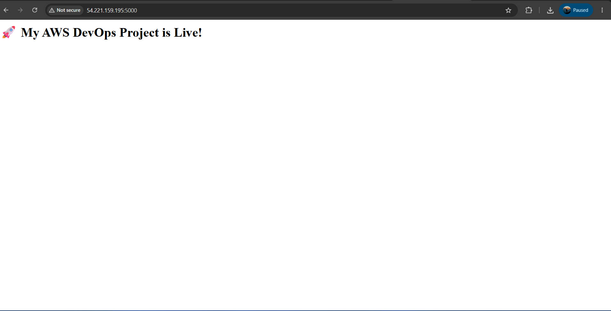
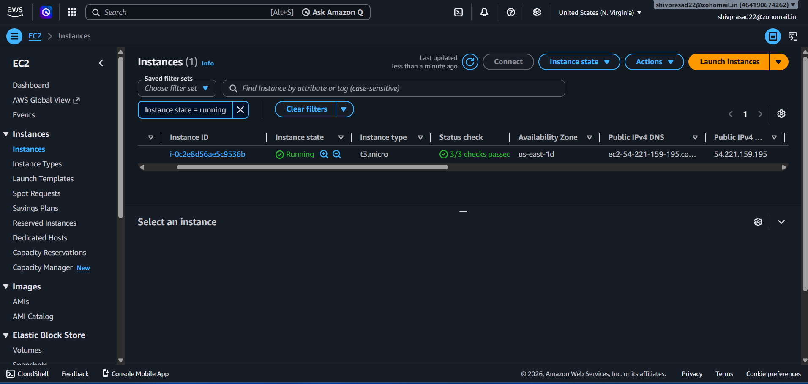
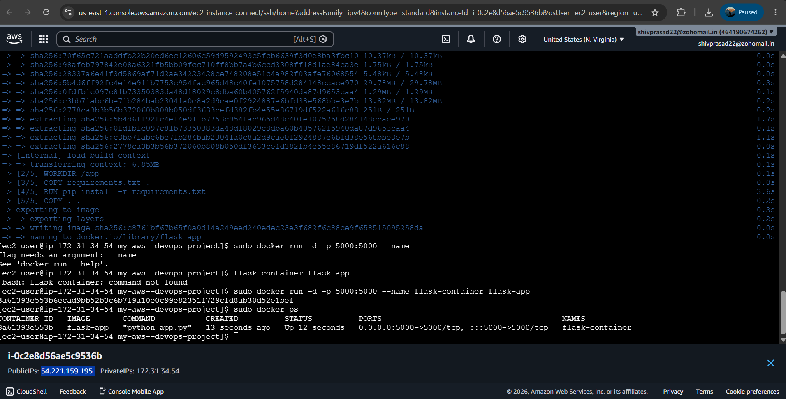
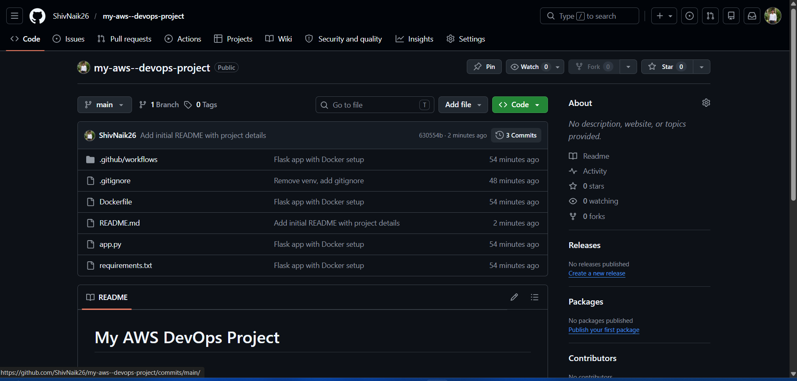

# My AWS DevOps Project

## Project Overview

This project demonstrates the deployment of a Python Flask application using Docker on an AWS EC2 instance.

## Technologies Used

* Python Flask
* Docker
* AWS EC2
* GitHub

## Features

* Flask Web Application
* Docker Containerization
* AWS EC2 Deployment
* Public Access Configuration

## Deployment Steps

1. Created a Flask application.
2. Containerized the application using Docker.
3. Pushed source code to GitHub.
4. Launched an AWS EC2 instance.
5. Installed Docker and deployed the container.
6. Configured Security Groups for external access.
7. Successfully tested the application deployment.

## Deployment Evidence

### Live Application

### AWS EC2 Instance

### Docker Container

### GitHub Repository

## Result

The Flask application was successfully containerized and deployed on AWS EC2 using Docker. The deployment was tested successfully and screenshots are provided as proof of deployment.
